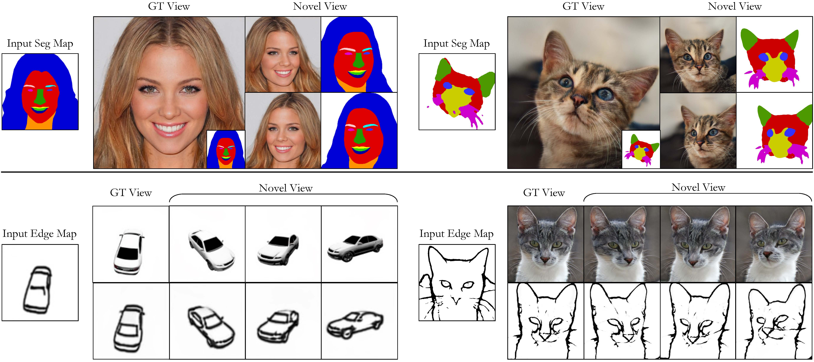
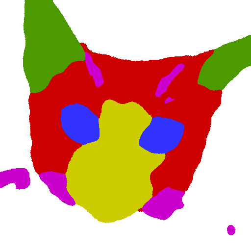
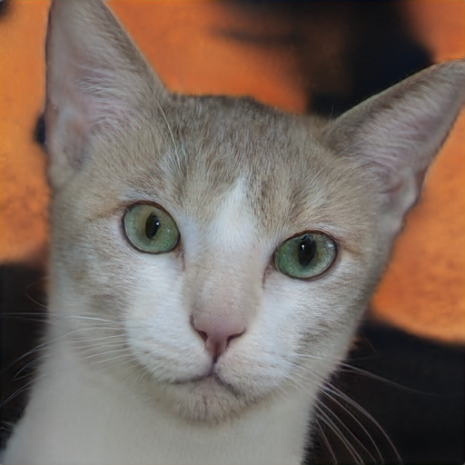
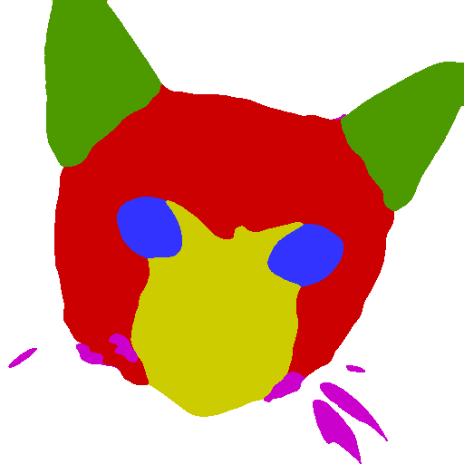
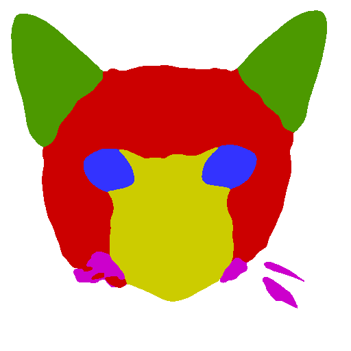

# 3D-aware Conditional Image Synthesis (pix2pix3D)

[**Project**](https://www.cs.cmu.edu/~pix2pix3D/) | [**Paper**](https://arxiv.org/abs/2302.08509)

This is the official PyTorch implementation of "3D-aware Conditional Image Synthesis". Pix2pix3D synthesizes 3D objects (neural fields) given a 2D label map, such as a segmentation or edge map. We also provide an interactive 3D editing demo. 

https://user-images.githubusercontent.com/28395429/222578030-8bb2c727-397e-44b6-9ab1-9b0b09dd3b5b.mp4


[3D-aware Conditional Image Synthesis](https://arxiv.org/abs/2302.08509)

CVPR 2023

 [Kangle Deng](https://dunbar12138.github.io/),
 [Gengshan Yang](https://gengshan-y.github.io/),
 [Deva Ramanan](https://www.cs.cmu.edu/~deva/),
 [Jun-Yan Zhu](https://www.cs.cmu.edu/~junyanz/)

Carnegie Mellon University

---

We propose pix2pix3D, a 3D-aware conditional generative model for controllable photorealistic image synthesis. Given a 2D label map, such as a segmentation or edge map, our model learns to synthesize a corresponding image from different viewpoints. To enable explicit 3D user control, we extend conditional generative models with neural radiance fields. Given widely-available monocular images and label map pairs, our model learns to assign a label to every 3D point in addition to color and density, which enables it to render the image and pixel-aligned label map simultaneously. Finally, we build an interactive system that allows users to edit the label map from any viewpoint and generate outputs accordingly.

<p align="center">
  
</p>

## Getting Started

### Dependencies

We provide a conda env file that contains all the other dependencies. You can use the following commands with Miniconda3 to create and activate your Python environment:
```
conda env create -f environment.yml
conda activate pix2pix3d
```

### Data

We provide our preprocessed datasets, including segmentation maps and edge maps. You can download the [CelebAMask](https://drive.google.com/drive/folders/1mC6i4YmdpazJSmXrW8WFSfsImAJ8a_CF?usp=sharing) dataset, [AFHQ-Cat-Seg](https://drive.google.com/drive/folders/1yjTTE57P9-hEe-IVcE-GXdh04WGo5lD9?usp=sharing) dataset, and [Shapenet-Car-Edge](https://drive.google.com/drive/folders/1XTPuu784DIvk0ie094qyLrcF-v-jMe3_?usp=sharing) dataset and put those zip files under ```data/```.


### Pre-trained Models

You can download our pre-trained models using the following script:
```
bash checkpoints/download_models.sh
```

---
### Inference

We provide several scripts to generate the results once you download the pre-trained models.

<p align="center">

</p>

#### Generate Samples
You can generate results based on the samples in the dataset.
```
python applications/generate_samples.py --network <network_pkl> --outdir <output_dir> --random_seed <random_seeds list, e.g. 0 1> --cfg <configs, e.g., seg2cat, seg2face, edge2car> --input_id <sample_id in dataset>
```
For example:

| Input Label Map  | Generated Image | Generated Label Map |
| ------------- | ------------- | -------- |
|   |   |  |

You can get the results above by running:
```
python applications/generate_samples.py --network checkpoints/pix2pix3d_seg2cat.pkl --outdir examples --random_seed 1 --cfg seg2cat --input_id 1666
```

#### Render Videos
You can render a video result based on a specified input label map.
```
python applications/generate_video.py --network <network_pkl> --outdir <output_dir> --random_seed <random_seeds list, e.g. 0 1> --cfg <configs, e.g., seg2cat, seg2face, edge2car> --input <input label map>
```

For example:
| Input Label Map  | Generated Image | Generated Label Map |
| ------------- | ------------- | -------- |
|   |   |  |

You can get the results above using the following command: 
```
python applications/generate_video.py --network checkpoints/pix2pix3d_seg2cat.pkl --outdir examples --random_seed 1 --cfg seg2cat --input examples/example_input.png
```

#### Extract Semantic Mesh
You can also extract the mesh and color it using 3D semantic labels. Some extra packages (`pyrender`, `trimesh`, and `mcubes`) are required for mesh extraction. You can install them by `pip`. The extracted mesh will be saved as `semantic_mesh.ply`.

For example:
| Input Label Map  | Semantic Mesh | 
| ------------- | ------------- | 
|   |   |

You can get the results above with the following command:
```
python applications/extract_mesh.py --network checkpoints/pix2pix3d_seg2cat.pkl --outdir examples --cfg seg2cat --input examples/example_input.png
```

<!-- #### Interpolation -->


### Training

We provide an example training script at `train_scripts/afhq_seg.sh`:
```
python train.py --outdir=<log_dir> \
                --cfg=afhq --data=data/afhq_v2_train_cat_512.zip \
                --mask_data=data/afhqcat_seg_6c.zip \
                --data_type=seg --semantic_channels=6 \ 
                --render_mask=True --dis_mask=True \ 
                --neural_rendering_resolution_initial=128 \
                --resume=<EG3D-checkpoints>/afhqcats512-128.pkl \
                --gpus=2 --batch=4 --mbstd-group=2 \ 
                --gamma=5 --gen_pose_cond=True \ 
                --random_c_prob=0.5 \
                --lambda_d_semantic=0.1 \
                --lambda_lpips=1 \
                --lambda_cross_view=1e-4 \
                --only_raw_recons=True \
                --wandb_log=False
```
Training parameters:
- `outdir`: The directory to save checkpoints and logs.
- `cfg`: Choose from [afhq, celeba, shapenet]. 
- `data`: RGB data file.
- `mask_data`: label map data file.
- `data_type`: Choose from [seg, edge]. Specify the `semantic_channels` if using `seg`.
- `render_mask`: Whether to render label maps along with RGB.
- `dis_mask`: Whether to use a GAN loss on rendered label maps.
- `neural_rendering_resolution_initial`: The resolution of NeRF outputs.
- `resume`: We partially initialize our network with EG3D pretrained checkpoints (download [here](https://catalog.ngc.nvidia.com/orgs/nvidia/teams/research/models/eg3d)).
- `gpus`, `batch`, `mbstd-group`: Parameters for batch size and multi-gpu training.
- `gen_pose_cond`: Whether to condition the generation on camera poses.
- `random_c_prob`: Probablity of sampling random poses for training.
- `lambda_d_semantic`: The weight of GAN loss on label maps.
- `lambda_lpips`: The weight of RGB LPIPS loss.
- `lambda_cross_view`: The weight of cross-view consistency loss.
- `wandb_log`: Whether to use wandb log.

### Prepare your own dataset

We follow the dataset format of EG3D [here](https://github.com/NVlabs/eg3d#preparing-datasets). You can obtain the segmentation masks of your own dataset by [DINO clustering](https://github.com/ShirAmir/dino-vit-features/blob/main/part_cosegmentation.py), and obtain the edge map by [pidinet](https://github.com/hellozhuo/pidinet) and [informative drawing](https://github.com/carolineec/informative-drawings).

---

## Citation

If you find this repository useful for your research, please cite the following work.
```
@inproceedings{kangle2023pix2pix3d,
  title={3D-aware Conditional Image Synthesis},
  author={Deng, Kangle and Yang, Gengshan and Ramanan, Deva and Zhu, Jun-Yan},
  booktitle = {CVPR},
  year = {2023}
}
```

---

## Acknowledgments
We thank Sheng-Yu Wang, Nupur Kumari, Gaurav Parmer, Ruihan Gao, Muyang Li, George Cazenavette, Andrew Song, Zhipeng Bao, Tamaki Kojima, Krishna Wadhwani, Takuya Narihira, and Tatsuo Fujiwara for their discussion and help. We are grateful for the support from Sony Corporation, Singapore DSTA, and the CMU Argo AI Center for Autonomous Vehicle Research.
This codebase borrows heavily from [EG3D](https://github.com/NVlabs/eg3d) and [StyleNeRF](https://github.com/facebookresearch/StyleNeRF). 
